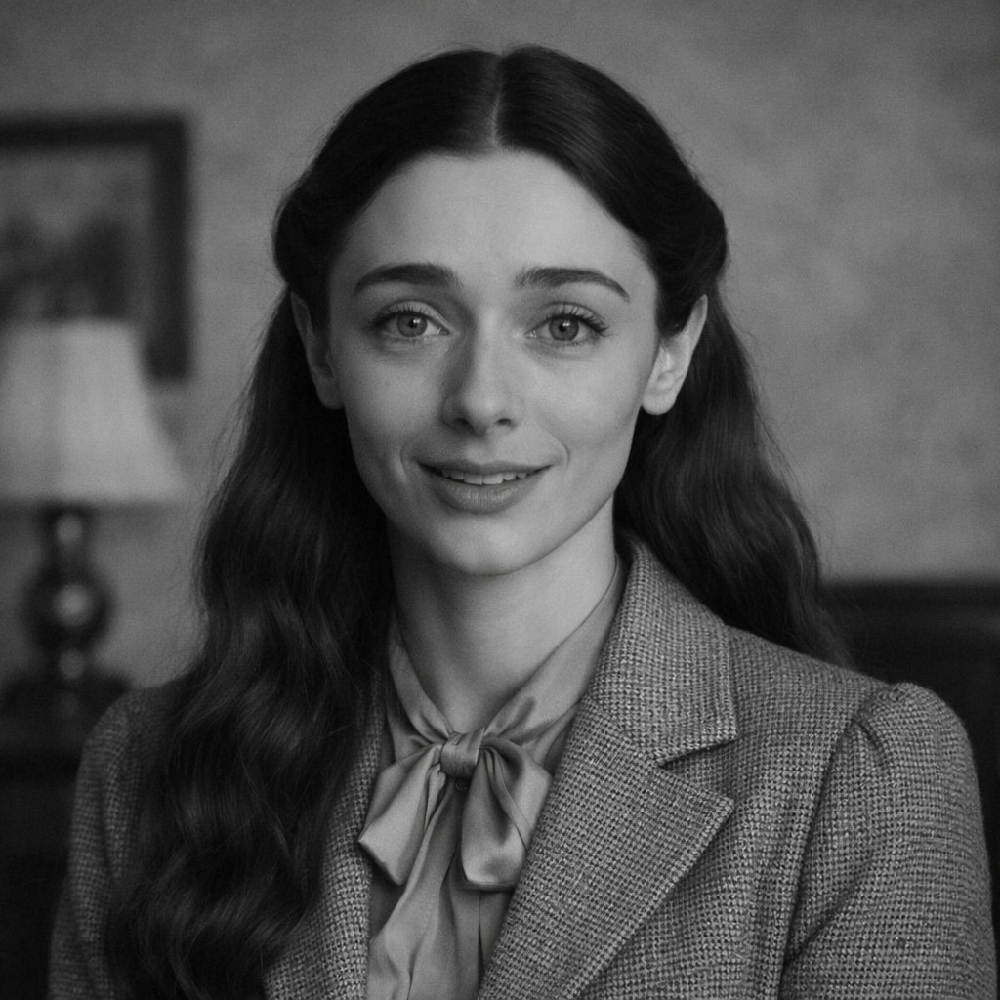

# VintageVoice

**The first open-source TTS model for historical speech patterns.**
*Proof of Antiquity for AI voices.*

> Dead accents preserved on vintage hardware compute. 164 hours of pre-1955 speech. 44,345 training segments. Built on a $69 refurb hard drive with pawn shop GPUs.

Digital preservation of voices the world is losing — transatlantic accents, newsreel narrators, Edison cylinder recordings, and the lost vocal styles of the 1880s-1960s.

<p align="center">

<br>
<em>Sophia Elya in Transatlantic Mode — same voice, vintage delivery</em>
</p>

**Model**: [VintageVoice on HuggingFace](https://huggingface.co/Scottcjn/vintage-voice) (coming soon)

## Why This Exists

The transatlantic accent — that trained mid-Atlantic broadcaster voice — is extinct. The last generation that spoke it died in the early 2000s. No modern TTS model can reproduce it because none were trained on it. The same is true for:

- **Newsreel narrator cadence** (1930s-1950s) — authoritative, theatrical, measured
- **Fireside chat delivery** — intimate, reassuring, presidential
- **Radio drama performance** — The Shadow, Mercury Theatre, Suspense
- **Edison cylinder voices** — literally the first humans ever recorded (born 1830s-1860s)
- **Vaudeville and early broadcast** — before microphone technique was standardized

Modern TTS sounds "friendly and natural." Vintage broadcast was authoritative, measured, theatrical. These are fundamentally different speech patterns, not just different audio quality.

## What Makes This Different From "Just Add a Filter"

A filter adds crackle and EQ curves ON TOP of modern speech. VintageVoice learns the actual:

- **Speech patterns**: clipped consonants, rounded vowels, specific cadence
- **Prosody**: completely different rhythm and pacing than modern speech
- **Microphone technique**: how speakers physically positioned relative to carbon mics
- **Breath patterns**: theatrical breath control vs conversational breathing
- **Room acoustics**: learned representations of 1930s studio environments

## Voice Presets

| Preset | Era | Source Material | Description |
|--------|-----|----------------|-------------|
| `transatlantic` | 1920s-1960s | Films, radio, speeches | The classic trained mid-Atlantic accent |
| `newsreel` | 1930s-1950s | Movietone, Pathe, March of Time | "And now, the news!" narrator voice |
| `fireside` | 1933-1944 | FDR Fireside Chats | Intimate presidential broadcast delivery |
| `radio_drama` | 1930s-1950s | The Shadow, Suspense, Mercury Theatre | Theatrical dramatic performance |
| `edison` | 1888-1920s | Edison cylinder recordings | The oldest recorded human voices |
| `wartime` | 1939-1945 | Churchill, Murrow, WWII broadcasts | Wartime urgency and gravitas |
| `announcer` | 1930s-1960s | Radio commercials, station IDs | Trained professional announcer voice |

## Architecture

```
Training Data (Archive.org public domain)
    |
    v
Whisper Large V3 Turbo (transcription)
    |
    v
Alignment Pipeline (text <-> audio segments)
    |
    v
F5-TTS Base Model (zero-shot voice cloning)
    |
    v
Fine-tune on era-specific data
    |
    v
VintageVoice Model (GGUF + safetensors)
```

## Training Data Sources

All training data is **public domain** sourced from:

| Source | Content | Era | License |
|--------|---------|-----|---------|
| [Prelinger Archives](https://archive.org/details/prelinger) | Newsreels, educational films | 1930s-1960s | Public Domain |
| [Old Time Radio](https://archive.org/details/oldtimeradio) | Radio dramas, comedies | 1930s-1950s | Public Domain |
| [FDR Presidential Library](https://archive.org/search?query=creator%3ARoosevelt) | Fireside Chats, speeches | 1933-1944 | Public Domain |
| [Edison Cylinders](https://archive.org/details/edison) | Earliest recordings | 1888-1920s | Public Domain |
| [LibriVox](https://librivox.org) | Vintage audiobook recordings | Various | Public Domain |
| [Library of Congress](https://loc.gov/collections) | Historical audio | 1900s-1950s | Public Domain |

## Quick Start

```bash
# Install
pip install vintage-voice

# Generate speech with transatlantic accent
from vintage_voice import VintageVoice

model = VintageVoice("transatlantic")
model.speak("One simply must attest one's hardware before the epoch settles, dahling.")

# Use a specific historical voice preset
model = VintageVoice("newsreel")
model.speak("And now, from the laboratories of Elyan Labs, a breakthrough in computing!")

# Clone from a reference recording
model = VintageVoice.from_reference("path/to/fdr_fireside_chat.mp3")
model.speak("The only thing we have to fear is fear itself.")
```

## Data Pipeline

```bash
# 1. Download public domain recordings
python scripts/download_archive.py --collection old_time_radio --limit 200

# 2. Transcribe with Whisper
python scripts/transcribe.py --input data/raw/ --output data/transcribed/

# 3. Align text to audio segments
python scripts/align.py --input data/transcribed/ --output data/aligned/

# 4. Train on era-specific data
python scripts/train.py --preset transatlantic --data data/aligned/ --epochs 50

# 5. Export model
python scripts/export.py --format gguf --output models/vintage-voice-transatlantic.gguf
```

## Hardware Used

Trained on the [Elyan Labs](https://elyanlabs.ai) compute cluster:
- 2x Tesla V100 32GB (fine-tuning)
- IBM POWER8 S824 512GB RAM (large model experiments)
- Validated against actual vintage hardware audio output

## Training Data Stats

| Metric | Value |
|--------|-------|
| **Total segments** | 44,345 |
| **Total audio** | 164.59 hours |
| **Vocab tokens** | 167 |
| **Source files** | 2,581 recordings |
| **Era coverage** | 1888-1955 |
| **Format** | 24kHz mono WAV, 5-15s segments |

For comparison, LJSpeech (the standard TTS benchmark) is 24 hours. We have **6.8x more data**, and it's all vintage.

## Training

**Base model**: F5-TTS v1 (337M parameters, flow-matching architecture)

**Key insight**: F5-TTS separates *voice identity* (from reference audio) from *speech style* (from training data). Fine-tuning teaches the model vintage speech patterns — transatlantic prosody, cadence, pronunciation. At inference, you provide any modern voice as reference, and the model generates speech in that voice but with vintage delivery.

This means you can make *anyone* speak with a transatlantic accent — not just clone a specific vintage speaker.

```bash
# Fine-tune on vintage data
python -m f5_tts.train.finetune_cli \
    --exp_name F5TTS_v1_Base \
    --dataset_name vintage_voice_f5_37k \
    --learning_rate 1e-5 \
    --batch_size_per_gpu 3200 \
    --epochs 50 \
    --finetune \
    --tokenizer custom \
    --tokenizer_path data/vocab.txt
```

## Project Status

| Component | Status |
|-----------|--------|
| Training data collection | **Done** — 2,581 files, 164 hours |
| Audio preprocessing | **Done** — 44,345 segments |
| Whisper transcription | **Done** — 43,876 transcribed |
| F5-TTS dataset preparation | **Done** — Arrow format ready |
| F5-TTS fine-tuning | **Training** — Epoch 1/50, loss 0.63 |
| `transatlantic` preset | In Progress |
| `newsreel` preset | Planned |
| `fireside` preset | Planned |
| `edison` preset | Planned |
| HuggingFace model release | After training completes |
| Python package | Planned |

## Commercial Applications

This isn't just a preservation project. Period-accurate voices have real demand:

- **Film & TV**: Any production set before 1960 (Boardwalk Empire, The Crown, Peaky Blinders)
- **Video Games**: Historical settings need period voices for every NPC (Bioshock, LA Noire, Fallout)
- **Audiobooks**: Vintage narration style for period literature
- **Documentaries**: Authentic narrator voices instead of modern approximations
- **Museums & Exhibits**: Historical figures speaking in their actual accent patterns
- **Theater**: Pre-production voice references for period plays
- **Podcasts**: Historical dramatizations and recreations

Hollywood pays voice coaches thousands per actor to teach transatlantic delivery. This model does it for free.

## The Preservation Angle

This isn't just a fun TTS model. It's digital preservation of speech patterns that are disappearing from living memory:

- The transatlantic accent was taught, not natural. No one teaches it anymore.
- Newsreel narration was a specific performance art. The last practitioners are gone.
- Edison cylinder voices are people born before the Civil War. Their speech patterns exist nowhere else.
- Radio drama delivery influenced an entire generation of performers. That tradition ended with television.

Every year, the people who remember these voices die. VintageVoice captures them before they're gone entirely.

## How It Was Built

**Total cost: ~$138** (drive + electricity)

| Component | Cost | What |
|-----------|------|------|
| Storage | $69 | 18TB Seagate Expansion (Amazon refurb) |
| GPUs | $0 | 2x Tesla V100 32GB (already in lab, eBay datacenter pulls) |
| Training data | $0 | Public domain from Archive.org |
| Base model | $0 | F5-TTS open source |
| Electricity | ~$69 | Estimated for 7 days V100 training |

The [Elyan Labs](https://elyanlabs.ai) compute cluster runs on pawn shop hardware, eBay datacenter pulls, and Amazon pallet resellers. $12K total investment, $40-60K retail value. 18+ GPUs, 228GB+ VRAM, IBM POWER8 with 512GB RAM, vintage PowerPC fleet.

## License

MIT License. Training data is public domain.

## Built By

[Elyan Labs](https://github.com/Scottcjn) — Where vintage hardware meets cutting-edge AI.

*"Proof of Antiquity for AI voices. The pawn shop lab that preserves what the big labs forgot."*

## Links

- [HuggingFace Model](https://huggingface.co/Scottcjn/vintage-voice) (coming soon)
- [Elyan Labs](https://elyanlabs.ai)
- [RustChain](https://rustchain.org) — Our blockchain with Proof of Antiquity hardware rewards
- [BoTTube](https://bottube.ai) — AI video platform (demo videos coming)
